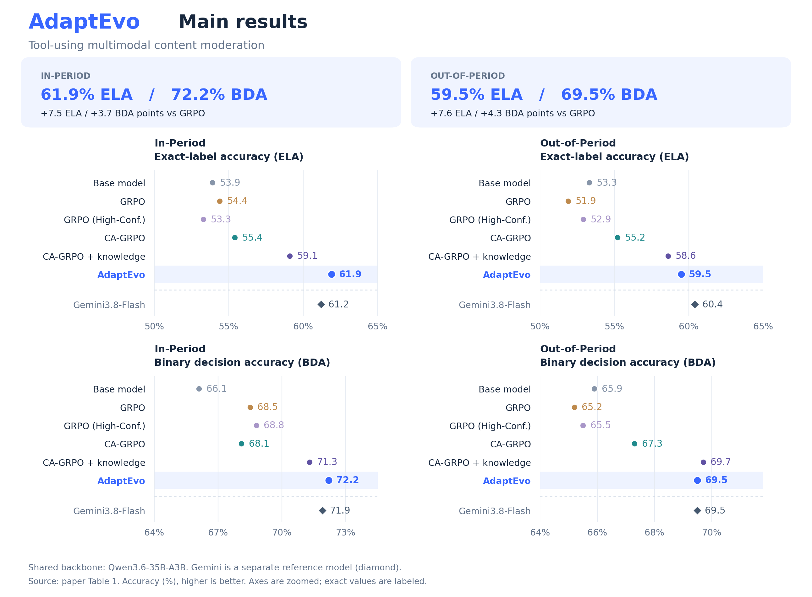
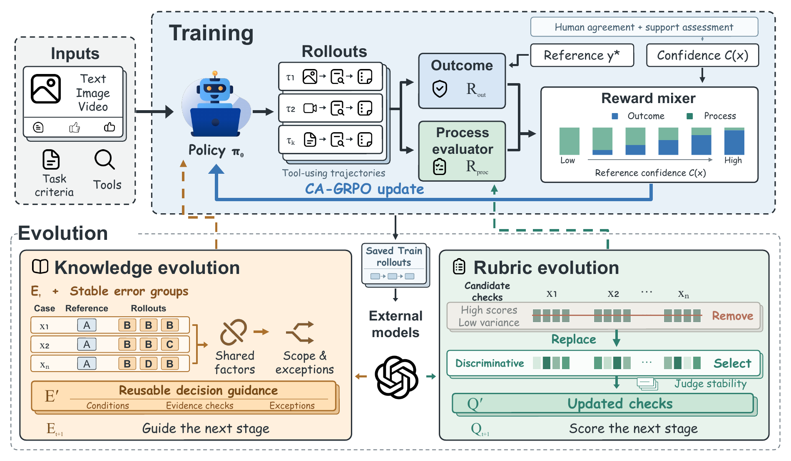

<p align="center">
  
</p>

<p align="center">
  <a href="AdaptEvo-arxiv.pdf"><b>Paper (PDF)</b></a> ·
  <a href="#paper-results">Results</a> ·
  <a href="#why-adaptevo">Why AdaptEvo?</a> ·
  <a href="#framework">Framework</a> ·
  <a href="#quick-start">Quick Start</a> ·
  <a href="docs/TRAINING.md">Training Guide</a>
</p>

<p align="center"><b>Fudan University · Sun Yat-sen University · Xiaohongshu</b></p>

**AdaptEvo brings policy learning, decision guidance, and process evaluation
into one Training–Evolution framework.** It learns under imperfect supervision
in **rule-governed contextual decision tasks**, where an agent applies written
rules to case-specific context and evidence, uses tools to resolve missing
information, and returns a decision with a grounded rationale.

Our application is **tool-using multimodal content moderation**. A case combines
a post, its review queue, queue-level and label-level rules, contextual tools,
and candidate labels. For example, evaluating an injury-related post can require
checking severity, everyday context, and rule exceptions before deciding whether
it violates a policy. Recognizing the visible content is one step in this broader
evidence-and-rule reasoning process.

The framework combines **Confidence-Adaptive GRPO (CA-GRPO)** with reusable
**decision knowledge** and evolving **process rubrics**. Its agent runs on
AgentScope, with distributed RL integration through Relax. This repository
provides the implementation, prompt templates, integration guides, and synthetic
examples used to explore the framework.



- **Best In-Period results among all evaluated configurations:** 61.9% ELA
  and 72.2% BDA, exceeding Gemini3.8-Flash by 0.7 and 0.3 percentage points.
- **Strong Out-of-Period transfer:** AdaptEvo reaches 59.5% ELA and 69.5% BDA,
  improving over GRPO by 7.6 and 4.3 points. It has the highest ELA among
  the evaluated shared-backbone configurations.
- **Generalization during training:** without injected knowledge, CA-GRPO
  stays above the base model in Out-of-Period ELA at every evaluated
  checkpoint, while continued GRPO training degrades performance.

## Why AdaptEvo?

Learning a decision policy depends on the quality of its supervision and the
operational guidance available to both the agent and its evaluator:

- **References have unequal support.** Reviewers can disagree about the same
  case, and even unanimous labels can lack support from the rules and available
  evidence. CA-GRPO combines human agreement with an external support assessment
  to adjust reliance on outcome and process feedback.
- **Written rules leave practical gaps.** A rule may not fully specify how to
  acquire evidence, distinguish neighboring labels, or handle exceptions in
  every context. Knowledge evolution analyzes recurring problems across training
  cases and turns their shared factors into conditional decision guidance.
- **Process checks can lose discrimination.** Generic checks may give similarly
  high scores to trajectories with different quality. Rubric evolution compares
  rollout scores across multiple cases, accounts for repeated-judge noise, and
  validates more discriminative checks before the next training stage.

These components adapt together: training updates the policy, while evolution
revises the guidance and feedback used for subsequent learning. Our experiments
cover two training stages and one joint knowledge–rubric update.

## Framework



AdaptEvo alternates **Training** and **Evolution**. Each training stage keeps
its decision knowledge and process rubric fixed; evolution freezes the policy
and prepares the guidance and evaluator checks for the next stage.

| Component | What it does |
|---|---|
| **Training: CA-GRPO** | Balances reference-based outcome rewards and trajectory-level process rewards using reference confidence. More strongly supported references receive greater outcome weight; uncertain references receive greater process weight. |
| **Knowledge evolution** | Groups different training cases with recurring rollout/reference mismatches, then jointly analyzes their rules and evidence. It extracts shared conditions, required checks, boundaries, and exceptions into reusable guidance. |
| **Rubric evolution** | Identifies checks with high scores and consistently low within-case discrimination across many cases. Candidate replacements are screened against repeated-judge noise and re-evaluated on a separate training panel. |

For knowledge extraction, an error group may contain different cases whose
references are A but whose repeated rollouts predominantly predict B. An external
model examines the group jointly to identify shared evidence patterns and
missing checks, then tests the conditions and exceptions that delimit the
resulting guidance. Recurring disagreement identifies cases for diagnosis;
rule and evidence support determine which distinctions enter the knowledge. Rubric updates revise
checks and scoring anchors within the same five dimensions and fixed weights.
Training data supplies diagnosis and update selection; final test cases are
excluded. The applicable task rules remain fixed throughout a training run.
See the [evolution workflow](docs/EVOLUTION.md) for practical guidance.

## Paper Results

**In-Period** evaluates cases from the training-data collection period.
**Out-of-Period** evaluates later cases under changed governing rules.
**ELA** is exact-label accuracy; **BDA** is binary decision accuracy after
merging all violation labels. Both measure agreement with reference labels.
Scores are percentages; higher is better.

The chart above compares six configurations sharing the
**Qwen3.6-35B-A3B** backbone, with Gemini3.8-Flash shown separately as a
reference model. Full cross-model results are available in the
[paper](AdaptEvo-arxiv.pdf).

GRPO (High-Conf.) trains only on cases with unanimous human labels and a QC
label-rationale pair assessed as supported by Kimi-K3. **CA-GRPO + knowledge**
adds evolved knowledge at inference to the same CA-GRPO checkpoint.
**AdaptEvo** continues training with that knowledge and an updated rubric.
Trained configurations use their reported 60-step checkpoints; AdaptEvo includes initial
and continued training.

AdaptEvo exceeds GRPO by **7.5 / 3.7 ELA / BDA points** on In-Period and
**7.6 / 4.3 points** on Out-of-Period. On the latter, Gemini has the highest
ELA across all models (60.4%), while CA-GRPO + knowledge has the highest
BDA (69.7%). AdaptEvo approaches Gemini in ELA and matches its BDA.

The plotted values are stored in [main-results.json](docs/assets/main-results.json).
A [vector version](docs/assets/main-results.svg) is also available.
To regenerate the chart:

```bash
pip install matplotlib
python scripts/plot_readme_results.py
```

## Quick Start

Use Python 3.11 or 3.12 in an isolated environment. GPU training dependencies
are separate from inference dependencies.

```bash
python3 -m venv .venv
source .venv/bin/activate
pip install -e ./agentscope
pip install -r requirements-eval.txt
export PYTHONPATH="$PWD:$PWD/agentscope/src:$PWD/relax_agentic:${PYTHONPATH:-}"

# No API, production data, or GPU required.
python -m examples.reward_smoke
python -m pytest audit_agentic/tests -q

# Requires a user-provided, tool-calling OpenAI-compatible model service.
export OPENAI_BASE_URL='http://localhost:8000/v1'
export OPENAI_MODEL='your-model-name'
export OPENAI_API_KEY='your-api-key'
python -m examples.synthetic_audit
```

The synthetic example uses a locally defined rule and a deterministic tool.
It does not query business services. Live model output is not deterministic.

## Moderation Task

A case combines a post and its moderation queue. The queue determines which
rules and candidate labels apply; the agent gathers additional evidence as
needed and returns one candidate label with a grounded rationale.

| Element | Role |
|---|---|
| Post and context | Text, available images or video frames, and relevant metadata |
| Moderation queue | Review scope and candidate labels: one **pass** label plus the queue's **violation** labels |
| Queue-level rules | Shared applicability conditions and review instructions |
| Label-level rules | Conditions, evidence requirements, boundaries, and exemptions for each violation label |
| Tools | Retrieve complete label rules and contextual evidence, such as comments or similar posts |
| Output | A structured decision: `predict_label`, `decision_basis`, and optional `used_evidence_ids` |

In `preview_tool` mode, the initial prompt contains full queue-level guidance
and label-rule previews; `get_detail_rule` retrieves complete rules on demand.
Evidence arrives through tool observations and can include text and images.
The human reference and reviewer rationale are used offline for learning and
evaluation, not supplied in the agent's inference prompt. See the
[data contract and tool adapters](docs/INTEGRATION.md) and the
[synthetic task](examples/synthetic_audit.py).

## Components

| Directory | Purpose |
|---|---|
| `audit_agentic/agents` | AgentScope reasoning/tool loop, structured decisions, multimodal preparation |
| `audit_agentic/environment` | Tool interfaces, rule retrieval, experience injection, cache adapters |
| `audit_agentic/rewards` | GT confidence, adaptive reward, process judge client and score parsing |
| `audit_agentic/relax_app` | Managed rollout protocol, reward export, multimodal wire-history handling |
| `audit_agentic/eval` | Dataset evaluation, metrics, provider adapters |
| `prompt_templates` | Process rubrics and candidate-dimension pool |
| `scripts` | Confidence-data preparation and judge diagnostics |
| `agentscope` | Vendored, modified AgentScope source snapshot |
| `relax_agentic` | Vendored, modified Relax source snapshot |
| `examples` | Synthetic inference and reward examples |

## Integration Guides

- [Tool and evaluation integration](docs/INTEGRATION.md)
- [Training integration and prerequisites](docs/TRAINING.md)
- [Experience and rubric evolution workflow](docs/EVOLUTION.md)
- [Public-release boundaries and verification](docs/PUBLIC_RELEASE.md)
- [Third-party notices](THIRD_PARTY_NOTICES.md)

Business tool implementations are integration references. Their original
services and caches are not public dependencies; replace them with your own
adapters or provide offline fixtures. The distributed training stack requires
compatible CUDA, PyTorch, Ray, Megatron and SGLang installations. This release
does not provision a cluster or claim independently reproduced paper results.

## Release Scope

This source release includes the agent, reward implementation, training
integration, prompt templates, tests, and synthetic examples. The industrial
datasets, business rule/tool caches, learned knowledge, trained checkpoints,
and private evaluation traces are not included. The paper states that the
training and evaluation datasets will be publicly released.

Smoke tests exercise the included implementation; reproducing the paper
results requires the experimental data, model services, and training setup.
See [public-release boundaries and verification](docs/PUBLIC_RELEASE.md).

## Citation

If you use this code or build on the framework, please cite the paper:

```bibtex
@misc{wan2026adaptevo,
  title        = {AdaptEvo: Adaptive Agent Learning with Evolving Supervision},
  author       = {Shijun Wan and Jiancong Xie and Hang Xu and Jin Duan and
                  Qixiong Wang and Xi Xiang and Maofei Que and Yahui Liu and
                  Zhongyu Wei and Mu Chuan},
  year         = {2026},
  howpublished = {Technical report},
  url          = {https://github.com/AllSpark-Research/AdaptEvo}
}
```

## Licensing

Vendored components retain their existing licenses and copyright notices.
A project-wide license for the AdaptEvo-specific code has not yet been chosen;
public repository visibility alone does not grant a new license. See
[third-party notices](THIRD_PARTY_NOTICES.md) before redistributing.
